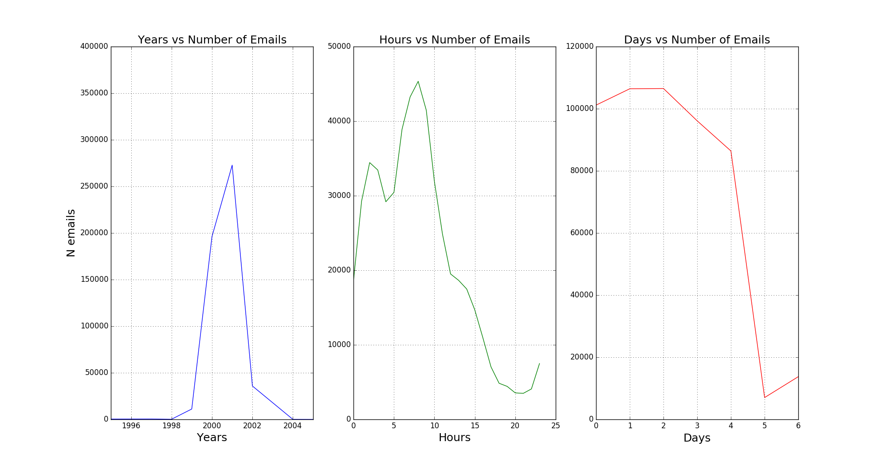
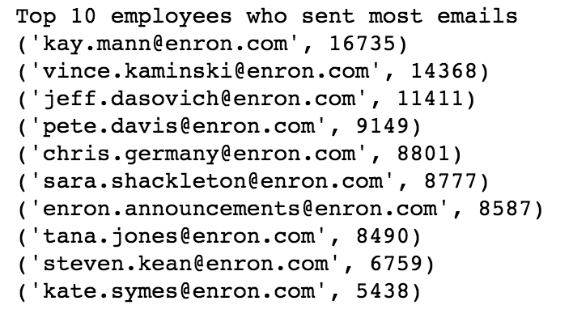
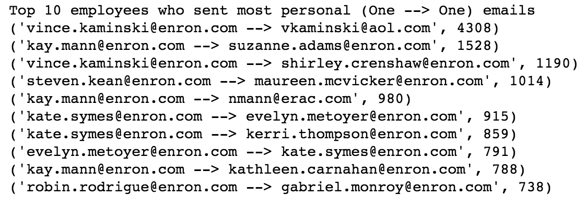
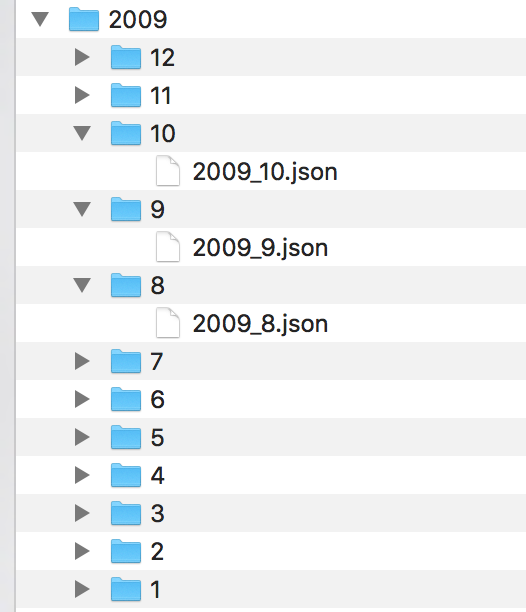
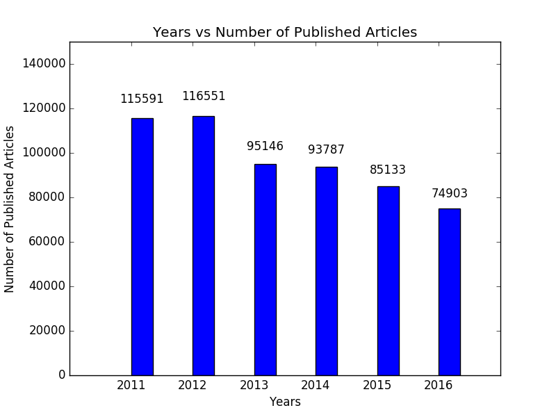
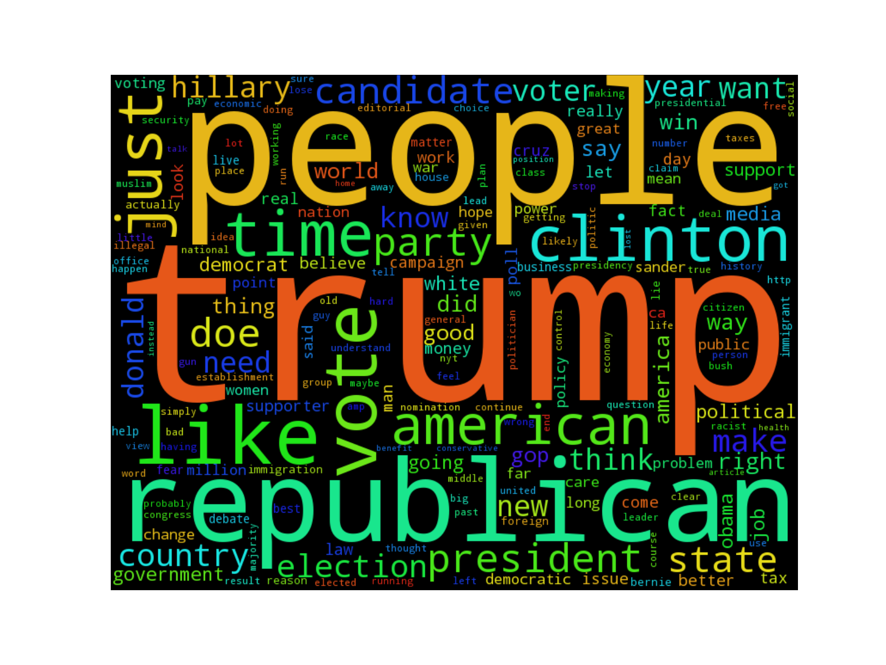

# Midterm Exam - Spring 2017 
---
### Question 1) Using Enron data-set, perform **3**  analysis.

- [Enron Scandal Summary](http://www.investopedia.com/updates/enron-scandal-summary/) - Link to Investopedia article to get a brief summary about what the scandal was.
- The enron data-set is available at [CMU Enron data 1.82 GB tgz file](https://www.cs.cmu.edu/~./enron/enron_mail_20150507.tgz) .
- It is downloaded and stored at ~/MidTerm/data/enron/maildir on local folder
- In this folder there is 1 email per file 

#### 1. Understanding Data
        A typical email file in the dataset will look like
        "Message-ID: <18782981.1075855378110.JavaMail.evans@thyme>
        Date: Mon, 14 May 2001 16:39:00 -0700 (PDT)
        From: phillip.allen@enron.com
        To: tim.belden@enron.com
        Subject: 
        Mime-Version: 1.0
        Content-Type: text/plain; charset=us-ascii
        Content-Transfer-Encoding: 7bit
        X-From: Phillip K Allen
        X-To: Tim Belden <Tim Belden/Enron@EnronXGate>
        X-cc: 
        X-bcc: 
        X-Folder: \Phillip_Allen_Jan2002_1\Allen, Phillip K.\'Sent Mail
        X-Origin: Allen-P
        X-FileName: pallen (Non-Privileged).pst"

        Here is our forecast
        
#### 2. Loading data and Parsing
- Data is loaded and each email file is parsed into EmailFrame class structure
- Prepared AllEmails dictionary where "Key -> Message-ID; Value -> EmailFrame Object"

#### 3. Analysis 1: Count of Emails according to year, hour and day
- Plotting these emails against time variables to understand email count
- We understand a small number of emails being sent on Saturdays and Sundays 
  

#### 4. Analysis 2: Find who sends most emails?

- Most personal emails senders?
- From this analysis we understand that we can closely look into these employees for anything suspicious

#### 5. Analysis 3: What do they write in personal Emails?
- Most frequently used words can be parsed from contents of these emails
- This wordcloud would tell us about the topics these employees must have discussed

---
### Question 2) Use NYT API to collect NYT data. Perform 3 analysis on the collected data.
- Link to NYT developer docs : [NYT API Documentation](http://developer.nytimes.com/)
- All API from NYT are *Restful* and they provide data in *JSON* format  
- API key from NYT is needed to download data 

#### 1. Understanding Data
        A typical article data from NYT looks like
        {
            "_id": "4fbfd31a45c1498b0d0094f5",
            "abstract": null,
            "blog": [],
            "byline": null,
            "document_type": "article",
            "headline": {
                "kicker": "1",
                "main": "France and Great Britain."
            },
            "keywords": [],
            "lead_paragraph": "LOUIS NAPOLEON just now seems omnipotent in France. He has the army on his side, at his bidding. That vast body of armed men perpetrates the grossest outrages upon law, and tramples alike upon personal and public rights.",
            "multimedia": [],
            "news_desk": null,
            "print_page": "4",
            "pub_date": "1852-01-01T00:03:58Z",
            "section_name": null,
            "slideshow_credits": null,
            "snippet": "LOUIS NAPOLEON just now seems omnipotent in France. He has the army on his side, at his bidding. That vast body of armed men perpetrates the grossest outrages upon law, and tramples alike upon personal and public rights....",
            "source": "The New York Times",
            "subsection_name": null,
            "type_of_material": "Article",
            "web_url": "http://query.nytimes.com/gst/abstract.html?res=9C02E2DC1331E234BC4953DFB7668389649FDE",
            "word_count": 756
        }
 
#### 2. Storing data
- The articles are stored as "~/year/month/year-month.json" 
 
#### 3. Loading and parsing data &emsp;&emsp;&emsp;&emsp;&emsp;&emsp;&emsp;&emsp;&emsp;[Q2.py](stuff/source/Q2.py)&emsp;[Q2.ipynb](Q2_ana_[1_3].ipynb)
- The data is loaded as json and an Article class object instances are prepared

#### 4. Analysis 1: Answer trivial questions
- Total number of articles
- What are different News Categories?
- Number of articles NYT publishes per year?
- Which author published the most articles?

- These things help build analysis of News Categories, Frequency of articles etc.

#### 5. Analysis 2: Reporters on President Donald Trump
- I am interested in finding reporters reporting on President Donald Trump and store that count
- Recently President Trump accused New york times reporters on spreading lies about him.
- I want to know exactly which reporters reported on him the most

#### 6. Analysis 3: Retrieve user comments and find most frequent words
- I am intersted in finding user comments on articles of these reporters
- NYT provides community API with which we can get comments posted on NYT articles
- These are stored in "~/comments/" folder as json files
- The most frequent words that are used by these commenters will give an insight about the general feeling in the population

