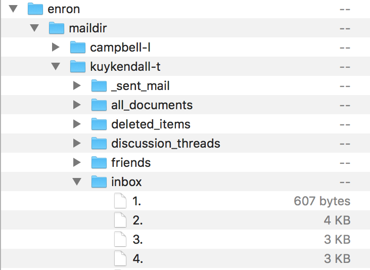
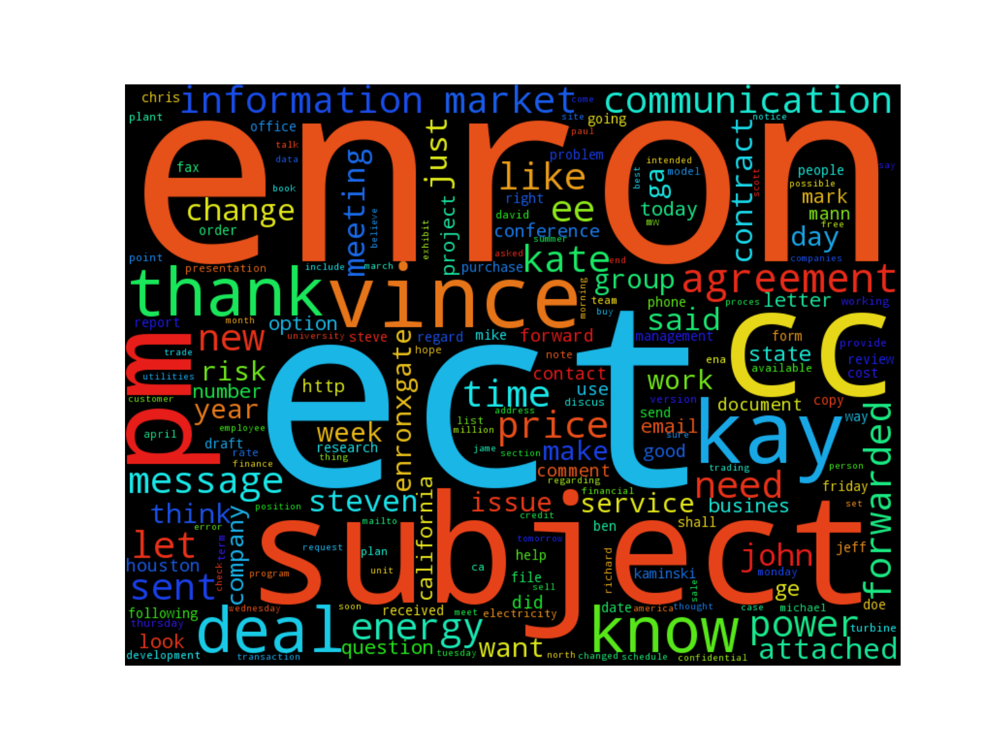

# Midterm Exam - Spring 2017 

---
### Question 1) Using Enron data-set, perform **3**  analysis.

- [Enron Scandal Summary](http://www.investopedia.com/updates/enron-scandal-summary/) - Link to Investopedia article to get a brief summary about what the scandal was.
- The enron data-set is available at [CMU Enron data 1.82 GB tgz file](https://www.cs.cmu.edu/~./enron/enron_mail_20150507.tgz) .
- It is downloaded and stored at ~/MidTerm/data/enron/maildir on local folder
- In this folder there is 1 email per file 

#### 1. Understanding Data
        A typical email file in the dataset will look like
        "Message-ID: <18782981.1075855378110.JavaMail.evans@thyme>
        Date: Mon, 14 May 2001 16:39:00 -0700 (PDT)
        From: phillip.allen@enron.com
        To: tim.belden@enron.com
        Subject: 
        Mime-Version: 1.0
        Content-Type: text/plain; charset=us-ascii
        Content-Transfer-Encoding: 7bit
        X-From: Phillip K Allen
        X-To: Tim Belden <Tim Belden/Enron@EnronXGate>
        X-cc: 
        X-bcc: 
        X-Folder: \Phillip_Allen_Jan2002_1\Allen, Phillip K.\'Sent Mail
        X-Origin: Allen-P
        X-FileName: pallen (Non-Privileged).pst"

        Here is our forecast
        
#### 2. Loading data and Parsing
- Data is loaded and each email file is parsed into EmailFrame class structure
- Prepare AllEmails dictionary where "Key -> Message-ID; Value -> EmailFrame Object"

#### 3. Analysis 1 : Count of Emails according to year, hour and day
- Plotting these emails against time variables to understand email count
- We understand a small number of emails being sent on Saturdays and Sundays 
  

#### 4. Analysis 2: Find who sends most emails? and most personal emails?
-  
- From this analysis we understand that we can closely look into these employees for anything suspicious

#### 5. Analysis 3: What do they write in personal Emails?
- Most frequently used words can be parsed from contents of these emails
- This wordcloud would tell us about the topics these employees must have discussed

---
